# ESP32 LoRa Mesh Network - Technical Datasheet & System Review

**Version:** 1.0
**Date:** 2025-12-13
**Project:** ESP32-WIP (LoRa Mesh)

---

## 1. Executive Summary

The **ESP32 LoRa Mesh Network** is a decentralized, self-organizing wireless sensor network designed for long-range environmental monitoring in areas without cellular or WiFi infrastructure. It utilizes **LoRa (Long Range)** radio modulation for physical communication and implements a custom **Time Division Multiple Access (TDMA)** protocol synchronized via **GPS** to prevent packet collisions.

The system features a **gradient-based routing algorithm** that naturally directs data currents toward a central Gateway node, significantly ensuring efficiency compared to traditional mesh flooding.

---

## 2. Hardware Specifications

| Component | Specification | Function |
| :--- | :--- | :--- |
| **MCU** | ESP32-S3 (Heltec WiFi Kit 32 V3) | Core processing, Bluetooth/WiFi stack, OLED control |
| **Radio** | Semtech SX1262 LoRa | 915 MHz communication, -135 dBm sensitivity |
| **GPS** | u-blox NEO-6M | Time synchronization (PPS accuracy) & Geolocation |
| **Sensors** | SHT30 (I2C 0x44) | Temperature (-40 to 125°C) & Humidity (0-100%) |
|  | BMP180 (I2C 0x77) | Barometric Pressure (300-1100 hPa) & Altitude |
| **Display** | 0.96" OLED (SSD1306) | System status, visual debugging, packet counters |

---

## 3. Communication Protocol Architecture

The network stack operates on three distinct layers:

### Layer 1: Physical (LoRa PHY)
*   **Frequency:** 915.0 MHz (ISM Band)
*   **Bandwidth:** 250 kHz
*   **Spreading Factor:** SF7 (Balanced range/speed)
*   **Coding Rate:** 4/5
*   **Sync Word:** 0x12 (Private Network)

### Layer 2: Mesh MAC (Media Access Control)
The MAC layer handles routing, collision avoidance, and packet integrity.

#### Packet Structure (8-Byte Header)
Every packet transmitted over the air begins with a strict 8-byte header defined in `include/mesh_protocol.h`:

```c
struct MeshHeader {
    uint8_t version;      // Protocol Ver (0x01)
    uint8_t messageType;  // Enum: REPORT=0x01, BEACON=0x0A, etc.
    uint8_t sourceId;     // Origin Node ID (Fixed)
    uint8_t destId;       // Destination Node ID (0x00=Gateway)
    uint8_t senderId;     // Last Hop Transmitter ID (Changes per hop)
    uint8_t messageId;    // Rolling Sequence # (0-255)
    uint8_t ttl;          // Time-To-Live (Starts at 3, decrements)
    uint8_t flags;        // Bitmask: [0]=ACK_REQ, [1]=FORWARDED
};
```

#### Message Types
| Type | ID | Description | Payload Size |
| :--- | :--- | :--- | :--- |
| `MSG_FULL_REPORT` | `0x01` | Full sensor data (Temp, Hum, GPS, Pressure) | 32 Bytes |
| `MSG_BEACON` | `0x0A` | Routing gradient advertisement + Time Sync | 16 Bytes |
| `MSG_ACK` | `0x03` | Receipt confirmation | 0 Bytes |

### Layer 3: Application & TDMA
The application layer manages sensor data acquisition and enforces strict timing.

#### TDMA Scheduler (`src/tdma_scheduler.cpp`)
To prevent "hidden node" collisions, the network divides time into **60-second cycles**.
*   **Cycle Duration:** 60 Seconds
*   **Slot Duration:** 12 Seconds per Node
*   **Active TX Window:** 10 Seconds (2s guard band)
*   **Capacity:** 5 Nodes (IDs 1-5)

| Node ID | Start Time (s) | End Time (s) | Primary TX Time (s) |
| :---: | :---: | :---: | :---: |
| **1** | 00 | 12 | 06 |
| **2** | 12 | 24 | 18 |
| **3** | 24 | 36 | 30 |
| **4** | 36 | 48 | 42 |
| **5** | 48 | 60 | 54 |

---

## 4. Key Algorithms & Logic

### 4.1 Gradient Routing (`src/gradient_routing.cpp`)
Unlike simple flooding, this network builds a **"Gradient"** of distance relative to the gateway.
1.  **Beacon Generation:** Gateway (Node 1) broadcasts a `MSG_BEACON` with `distance=0`.
2.  **Propagation:** Node 2 receives it, records Node 1 as its parent, sets its own `distance=1`, and rebroadcasts.
3.  **Route Selection:** Nodes always forward `MSG_FULL_REPORT` packets to the neighbor with the **lowest distance** to the gateway.
4.  **Fallback:** If no gradient exists, nodes fall back to controlled flooding.

**Key Function:**
```cpp
// include/gradient_routing.h
uint8_t getNextHop(uint8_t finalDestId); 
// Returns the NodeID of the best neighbor to forward to.
```

### 4.2 Time Synchronization Strategy
A hybrid approach ensures nodes stay synced even if GPS signal is lost.
1.  **Source A (Primary):** Onboard GPS Module (PPS signal). Accuracy: < 1µs.
2.  **Source B (Secondary):** Network Time Protocol (NTP) over LoRa.
    *   The gateway embeds its GPS time into `MSG_BEACON` payloads.
    *   Nodes calculate: `LocalTime = BeaconTime + (millis() - ReceiveTime)`.
    *   Accuracy: ~100-300ms (sufficient for 2s guard bands).

### 4.3 Duplicate Detection
To prevent broadcast storms:
*   Every node maintains a `DuplicateCache` (Circular buffer, size 32).
*   **Signature:** `(SourceID, MessageID)` pair.
*   If a received packet matches a signature in the cache, it is immediately dropped.

---

## 5. Software Configuration (`src/config.cpp`)

Configuration is centralized in `src/config.cpp` and `include/config.h`.

**Network Settings:**
```cpp
const uint8_t DEVICE_ID = 3;           // CHANGE THIS PER BOARD
const uint8_t GATEWAY_NODE_ID = 1;     // Fixed Gateway ID
const bool USE_GRADIENT_ROUTING = true; 
```

**Timing Constants:**
```cpp
#define MESH_DEFAULT_TTL 3             // Max hops
const unsigned long BEACON_INTERVAL_MS = 30000; // 30s Beacon
```

**Sensor Defines:**
```cpp
const bool SENSOR_SHT30_ENABLED = true;
const bool SENSOR_BMP180_ENABLED = true;
```

---

## 6. Dashboard & Visualization

### Gateway Web Interface
*   **Hosted on:** ESP32 Gateway (Node 1)
*   **Access:** WiFi AP `LoRa_Mesh` (192.168.4.1) or Station IP.
*   **Tech Stack:** AsyncWebServer (C++), HTML5/JS (Client).
*   **Features:** Real-time node table, connection lines, RSSI monitor.

### Desktop Dashboard (`desktop_dashboard/`)
*   **Platform:** Python (PC-side).
*   **Mechanism:** Reads JSON stream from Gateway via USB Serial.
*   **Features:**
    *   Map visualization (Folium/Leaflet).
    *   Network Topology Graph (Vis.js).
    *   ThingSpeak Uploader Bridge.

---

## 7. Future Improvements & Errata
*   **Battery Monitoring:** Currently hardcoded to 100%. Needs voltage divider implementation on `VBAT` pin.
*   **Encryption:** Payload is currently unencrypted. AES-128 is recommended for production.
*   **Dynamic Slots:** Current TDMA schedule is hardcoded for 5 nodes. A dynamic slot allocation handshake would allow >5 nodes.

---
## 8. Codebase Reference

This section provides a detailed breakdown of every source file in the project, explaining its purpose and key functions.

### 8.1 Core System & Communication

#### `src/main.cpp`
**Purpose**: The entry point of the firmware. Manages the main FreeRTOS-style loop (even though running on Arduino loop), checking sensors, handling mesh packets, and managing TDMA scheduling.
**Key Functions**:
*   `setup()`: Initializes Serial, I2C, Sensors, LoRa, and WiFi (if enabled). Checks hardware presence.
*   `loop()`: The main execution cycle. Calls `tdmaScheduler.loop()`, checks for incoming LoRa packets, reads sensors when appropriate, and handles serial input.

#### `src/lora_comm.cpp`
**Purpose**: Abstraction layer for the SX1262 LoRa radio.
**Key Functions**:
*   `initLoRa()`: Configures SPI, frequency (915MHz), sync word, and transmit power.
*   `sendBinaryMessage(uint8_t* data, uint8_t len)`: Sends a raw byte array over LoRa.
*   `receivePacket(LoRaReceivedPacket &packet)`: Reads available data from the radio into a structured packet container.
*   `getRSSI()` / `getSNR()`: Returns the signal quality metrics of the last received packet.

#### `src/packet_handler.cpp`
**Purpose**: Processes incoming raw LoRa packets. Determines if a packet is for this device, a broadcast, or needs forwarding.
**Key Functions**:
*   `checkForIncomingMessages()`: Main polling function. Reads from LoRa and dispatches to appropriate handlers (e.g., routing updates, sensor data).
*   `shouldForward(MeshHeader* header)`: Decides if a packet should be rebroadcasted based on TTL and destination.

#### `src/transmit_queue.cpp`
**Purpose**: specialized ring buffer for outgoing messages. Ensures messages are held until the correct TDMA time slot.
**Key Functions**:
*   `enqueue(uint8_t* data, uint8_t len)`: Adds a message to the waiting list.
*   `dequeue()`: Returns the next message to send (FIFO).
*   `prune()`: Removes old messages that exceeded their validity time.

#### `src/mesh_commands.cpp`
**Purpose**: Handles debug commands via Serial (e.g., "force send", "reset stats") and formats data for printing.
**Key Functions**:
*   `processMeshCommands()`: Parses text input from Serial monitor.
*   `printNeighborTable()`: Dumps the current routing table for debugging.

### 8.2 Routing & Mesh Layer

#### `src/gradient_routing.cpp`
**Purpose**: Implements the gradient routing algorithm. It maintains a "distance to gateway" metric to direct packets efficiently.
**Key Functions**:
*   `updateRoutingState(senderDist, senderId, ...)`: Updates this node's distance based on received beacons.
*   `getNextHop()`: Returns the Node ID of the best neighbor to forward packets to (lowest distance to gateway).
*   `sendBeacon()`: Broadcasts a routing beacon with current distance and Time Sync info.

#### `src/neighbor_table.cpp`
**Purpose**: Maintains a list of visible neighbors and their signal quality.
**Key Functions**:
*   `updateNeighbor(nodeId, rssi)`: specific neighbor entry update or creation.
*   `getNeighbor(nodeId)`: Retrieve stats for a specific neighbor.
*   `pruneStaleNeighbors()`: Removes neighbors not heard from in `NEIGHBOR_TIMEOUT_MS`.

#### `src/node_store.cpp`
**Purpose**: A database of the most recent status report from every node in the mesh.
**Key Functions**:
*   `updateNode(nodeId, payload)`: Stores the latest temperature/humidity/GPS data for a node.
*   `getNodeData(nodeId)`: Retrieval for display or dashboard.

#### `src/duplicate_cache.cpp`
**Purpose**: Prevents packet flooding loops. Remembers recent Message IDs and drops them if seen again.
**Key Functions**:
*   `isDuplicate(senderId, msgId)`: Checks the cache.
*   `add(senderId, msgId)`: Adds a new signature to the cache.

### 8.3 Timing & GPS

#### `src/tdma_scheduler.cpp`
**Purpose**: The heart of the collision avoidance system. Manages time slots.
**Key Functions**:
*   `updateWithFallback(gpsTime, valid)`: Syncs internal clock to GPS if available, otherwise runs on internal millis().
*   `shouldTransmitNow()`: Returns `true` if the current second matches the device's assigned slot.
*   `getSlotStart()` / `getSlotEnd()`: Returns the timing window for this device.

#### `src/network_time.cpp`
**Purpose**: Handles Time Synchronization propagation over the mesh for nodes without GPS.
**Key Functions**:
*   `updateNetworkTime(remoteTime)`: Adjusts local clock based on a received beacon's timestamp (compensating for hop flight time).
*   `getEpochTime()`: Returns the synchronized network time.

#### `src/neo6m.cpp`
**Purpose**: Driver for the U-Blox NEO-6M GPS module.
**Key Functions**:
*   `processGPSData()`: Feeds serial data to the TinyGPS++ library.
*   `getGPSHour()`, `getGPSMinute()`: Accessors for time data.
*   `hasFix()`: Returns `true` if location data is valid.

### 8.4 Sensors & Peripherals

#### `src/sht30.cpp`
**Purpose**: Driver for the SHT30 I2C temperature and humidity sensor.
**Key Functions**:
*   `read()`: Triggers a measurement.
*   `getTemperatureF()`: Returns temp in Fahrenheit.

#### `src/bmp180.cpp`
**Purpose**: Driver for the BMP180 I2C pressure sensor.
**Key Functions**:
*   `readPressure()`: Returns atmospheric pressure in Pascals.
*   `readAltitude(seaLevelPressure)`: Calculates altitude.

#### `src/OLED.cpp` & `src/display_manager.cpp`
**Purpose**: Manages the SSD1306 OLED display. `display_manager` is a high-level wrapper logic (screens, state), `OLED` is the low-level driver.
**Key Functions**:
*   `updateDisplay()`: Refreshes the screen content based on current state (Waiting, Sending, Received).
*   `drawBitmap()`: Used for icons.

#### `src/config.cpp`
**Purpose**: Global configuration file.
**Key Variables**:
*   `DEVICE_ID`: The unique hardcoded ID of the node.
*   `WIFI_ENABLED`: Hardware feature flag.

### 8.5 Web & Desktop Dashboard

#### `src/web_dashboard.cpp`
**Purpose**: Hosts a web server on the Gateway node to view data in a browser directly from the ESP32.
**Key Functions**:
*   `initWebDashboard()`: Starts the SoftAP or connects to WiFi.
*   `handleRoot()`: Serves the embedded HTML page.
*   `generateJSON()`: Returns current system state as JSON for the frontend.

#### `desktop_dashboard/serial_bridge.py`
**Purpose**: PC-side Python script that bridges the ESP32 Serial output to a local web server/WebSocket.
**Key Functions**:
*   `read_serial()`: Async loop reading lines from COM port.
*   `process_mesh_data()`: Parses JSON lines from ESP32.
*   `broadcast_update()`: Pushes new data to connected WebSocket clients (the browser).
*   `upload_to_thingspeak()`: Forwards data to the cloud.

#### `desktop_dashboard/dashboard.html`
**Purpose**: The frontend interface for the desktop dashboard.
**Key Components**:
*   `Leaflet Map`: Visualizes node locations.
*   `Vis.js Graph`: Renders the network topology (who connects to whom).
*   `WebSocket`: Connects to `serial_bridge.py` for live updates without page refresh.

---
## 9. System Architecture (UML)

The following Class Diagram illustrates the relationships and modular structure of the entire `src/` directory.

```mermaid
classDiagram
    %% Core System
    class Main {
        +setup()
        +loop()
    }
    class Config {
        +DEVICE_ID
        +WIFI_ENABLED
        +init()
    }
    class MemoryMonitor {
        +printReport()
        +checkHealth()
    }

    %% Communication Layer
    namespace Communication {
        class LoRaComm {
            +initLoRa()
            +sendBinaryMessage()
            +receivePacket()
            +getRSSI()
        }
        class PacketHandler {
            +checkForIncomingMessages()
            +shouldForward()
            +handleSensorData()
        }
        class TransmitQueue {
            +enqueue()
            +dequeue()
            +prune()
        }
        class MeshCommands {
            +processMeshCommands()
        }
    }

    %% Routing Layer
    namespace Routing {
        class GradientRouting {
            +updateRoutingState()
            +getNextHop()
            +sendBeacon()
        }
        class NeighborTable {
            +updateNeighbor()
            +getNeighbor()
            +pruneStaleNeighbors()
        }
        class NodeStore {
            +updateNode()
            +getNodeData()
        }
        class DuplicateCache {
            +isDuplicate()
            +add()
        }
    }

    %% Timing & GPS
    namespace Timing_GPS {
        class TDMAScheduler {
            +updateWithFallback()
            +shouldTransmitNow()
        }
        class NetworkTime {
            +updateNetworkTime()
            +getEpochTime()
        }
        class Neo6m_GPS {
            +processGPSData()
            +getGPSHour()
            +hasFix()
        }
    }

    %% Sensors & Peripherals
    namespace Sensors_Peripherals {
        class SHT30 {
            +read()
            +getTemperatureF()
        }
        class BMP180 {
            +readPressure()
            +readAltitude()
        }
        class OLED_Driver {
            +drawBitmap()
            +drawString()
        }
        class DisplayManager {
            +updateDisplay()
            +showSplash()
        }
    }

    %% Statistics & Output
    namespace Stats_Output {
        class MeshStats {
            +logPacketReceived()
            +logPacketSent()
        }
        class SerialOutput {
            +printNetworkStatus()
        }
        class SerialJSON {
            +printNodeData()
            +printMeshStats()
        }
    }

    %% Web Integration
    namespace Web_Desktop {
        class WebDashboard {
            +initWebDashboard()
            +handleRoot()
        }
        class ThingSpeak {
            +initThingSpeak()
            +sendToThingSpeak()
        }
    }

    %% Relationships
    Main --> Config : uses
    Main --> MemoryMonitor : monitors
    Main --> PacketHandler : polls
    Main --> TDMAScheduler : drives
    
    PacketHandler --> LoRaComm : uses
    PacketHandler --> GradientRouting : consults
    PacketHandler --> DuplicateCache : checks
    PacketHandler --> TransmitQueue : queues
    
    GradientRouting --> NeighborTable : maintains
    GradientRouting --> LoRaComm : sends beacons
    
    TDMAScheduler --> Neo6m_GPS : syncs
    TDMAScheduler --> NetworkTime : fallbacks
    
    DisplayManager --> OLED_Driver : controls
    DisplayManager --> NodeStore : reads data
    
    WebDashboard --> NodeStore : serves data
    WebDashboard --> MeshStats : serves stats
    
    PacketHandler --> MeshStats : updates
    PacketHandler --> SerialOutput : logs
    PacketHandler --> SerialJSON : bridges
    
    Main --> ThingSpeak : uploads
```



---
*Generated by Antigravity AI - 2025*
